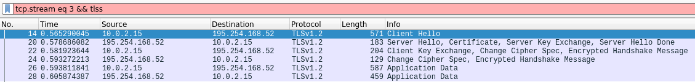
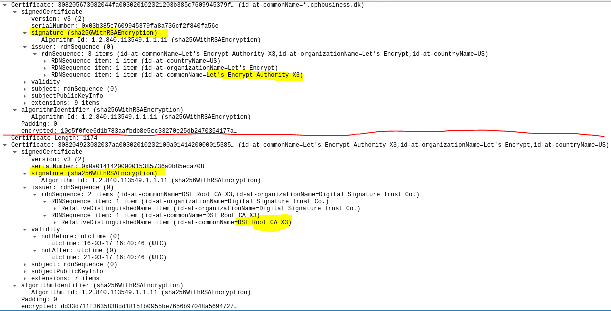
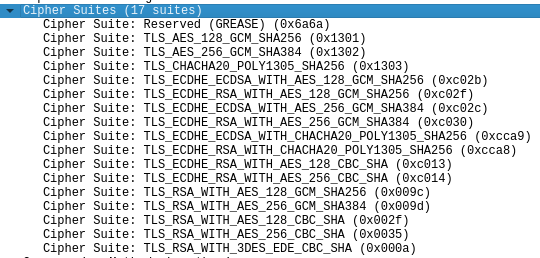
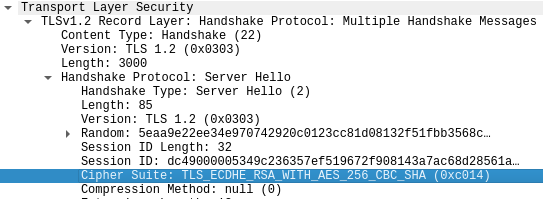

# Week 13 exercise 1

https://docs.google.com/document/d/13oD_h5fO9i1rIeQaiMxzG54w3q5dc0neL8nPGX2HEdw/edit


**Overview:**
  
Visiting the school website and recording the TLS handshake.  

### Questions: 

- How many of the messages from this figure, taken from the slides, can you identify in the captured traffic?  
(Client hello, server hello, server certificate, server hello done, client key exchange, change cipherspec, change cipherspec)  
As seen on the screenshot overview, we have a overview of the progress:  

First we see the **client hello**.  
Followed by the **server hello** which responds with certificate, its server key is exchanged and its hello is *done*.  
Then the  **client exchanges* its key, motions for change to the cipher spec and sends an encrypted handshake message to verify.   
Server then also responds with change in cipher spec and sends an encrypted handshake message to verify.  
Following data is encrypted.


- How many of the terms listed in the top of this exercise can you identify in the captured traffic (You need to open the Secure Socket Layer Packets) in the bottom window?

**Symmetric Encryption** can be seen in our cipher suite (shown below) in the form of `AES`.  
**Asymmetric Encryption** can be seen in our cipher suite as well, in the form of [Elliptic-curve DHE](https://en.wikipedia.org/wiki/Elliptic-curve_Diffie%E2%80%93Hellman).  
**Hashing and Hash Digests** can be seen in our encrypted handshake messages, or in the following application data.  

Example: 
```md
Frame 28: 459 bytes on wire (3672 bits), 459 bytes captured (3672 bits) on interface eth0, id 0
Ethernet II, Src: RealtekU_12:35:02 (52:54:00:12:35:02), Dst: PcsCompu_1f:30:76 (08:00:27:1f:30:76)
Internet Protocol Version 4, Src: 195.254.168.52, Dst: 10.0.2.15
Transmission Control Protocol, Src Port: 443, Dst Port: 33826, Seq: 3081, Ack: 1201, Len: 405
Transport Layer Security
    TLSv1.2 Record Layer: Application Data Protocol: http-over-tls
        Content Type: Application Data (23)
        Version: TLS 1.2 (0x0303)
        Length: 400
        **Encrypted Application Data: 604fb48ca6f2353ed6865c053d176d905f404a09d6dcd1d9…**

```  
**[MAC (Message Authentication Code)](https://www.zytrax.com/tech/survival/encryption.html#mac)**  can also be seen in the cipher suite as `SHA`.  
**Digital Signatures**, **Certificates** and **Certificate Authorities and Certificate Trust Hierarchies**:  

  


- How many Cipher Suites did the Client (browser) support?
The client (Chrome) supported a total of 17 suites:  
  

- Which of the Cipher Suites, supported by the client, was chosen by the server?  
The server chose the following cipher suite:  
```
Cipher Suite: TLS_ECDHE_RSA_WITH_AES_256_CBC_SHA (0xc014)
```  
(Diffie-Hellman -> RSA -> AES256("CBC") -> SHA)  
  

- Open one of the Secure Socket Layer packages for an Application Data request.  
Shown above - encrypted.

- Which overall strategy was used to encrypt the “Application Data” packages: Symmetric or Asymmetric (public key) encryption?  
According to the cipher suite we used AES_256_CBC which is symmetric.  

#### Extra:

*Change Cipherspec* is an action performed at the end, to update the prefered cipherspec between the two connections. This is meant to acknowledge between both parties that the cipher suite has been updated and will be used for subsequent records.

For more, see the implementation: https://tools.ietf.org/html/rfc5246#section-7.1

Other sources:  
https://sharkfestus.wireshark.org/sharkfest.12/presentations/A-2_Understanding_Encryption_Services_Using_Wireshark.pdf

More on MAC with HMAC:  
https://en.wikipedia.org/wiki/HMAC
