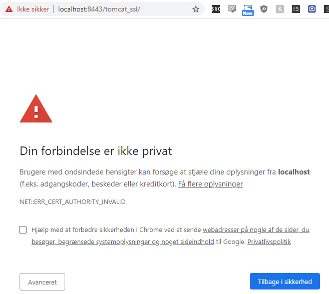
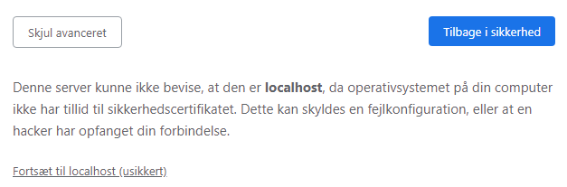
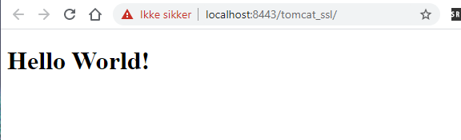
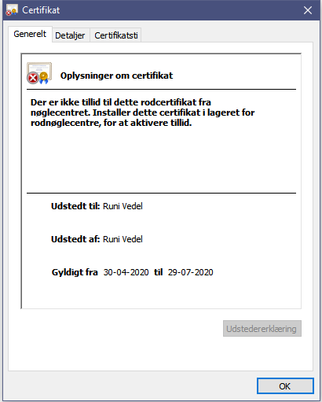
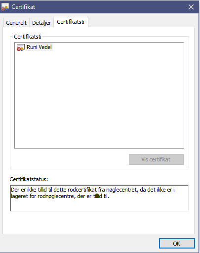

# Week 13 exercise 2

https://docs.google.com/document/d/1pY6gbHgAzzMZshgwIhejSZ9ROtQy8dHacci0mdJvdcI/edit#heading=h.3z8c0u5tz43x

## Tomcat with a self-issued certificate

### Observer your browsers reaction to the self-issued certificate

##### At first we get a warning.  

  

##### Clicking on `avanceret`, we are warned again but allowed to continue on our own terms:  

  

##### Clicking the *continue to localhost (unsafe)* leads us to the default java web `Hello World!`-index.html

  

##### Checking the certificate we get the following:

**General info**:  
  

**Certificate path**:  
 