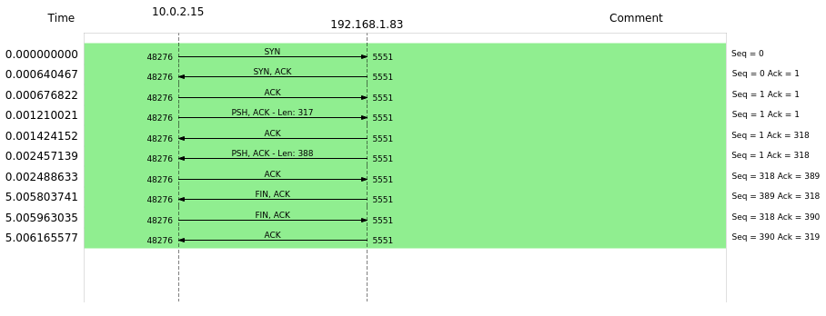
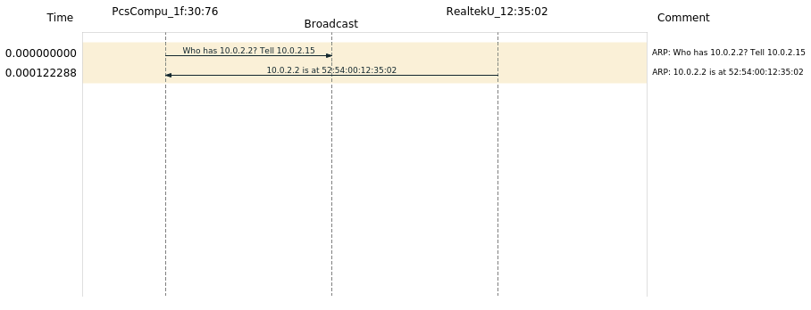

# Week 6, Thursday exercises
https://docs.google.com/document/d/1TWqiRRHUWRHJwSSt1riu84ErxndVuWE_VxXOz4gjhPI/edit

## Exercise 1 
- Find the IP address given to your local OS.
  - 192.168.1.83
- Open a shell in Kali and ping your local OS, using the IP-address found above to verify that you can access it.
```
PING 192.168.1.83 (192.168.1.83) 56(84) bytes of data.
64 bytes from 192.168.1.83: icmp_seq=1 ttl=127 time=0.498 ms
64 bytes from 192.168.1.83: icmp_seq=2 ttl=127 time=0.504 ms
64 bytes from 192.168.1.83: icmp_seq=3 ttl=127 time=0.466 ms
64 bytes from 192.168.1.83: icmp_seq=4 ttl=127 time=0.489 ms
64 bytes from 192.168.1.83: icmp_seq=5 ttl=127 time=0.441 ms
^C
--- 192.168.1.83 ping statistics ---
5 packets transmitted, 5 received, 0% packet loss, time 4100ms
rtt min/avg/max/mdev = 0.441/0.479/0.504/0.023 ms
```

### Getting the Wireshark Sample

- Open FireFox in Kali and type-in the IP+port, BUT DO NOT PRESS ENTER YET!!!, in order to get the 404-message from the server.
- Open Wireshark and locate the interface to use (probably eth0)
```eth0```
- In the capture filter box enter: host yourIP:port
```host 192.168.1.83:5551``` 
- Start the capture
- Hit ENTER in Firefox, and when you see the response (Cannot GET /) → Stop the capture  
Saved as `ex1_sample.pcapng` **[link](files/ex1_sample.pcapng)**


### Investigating the sample 
##### Identify the individual “envelope parts” of the HTTP package


- In the Capture filter box, type: http.
- This should provide you with two HTTP packages, the Request and the Response
  -  → Verify this via the Source and Destination fields
- Select the Response package and see whether you can identify the protocol-parts that:
- Include the payload (the HTML)
**Line-based text data** from the HTTP Protocol keeps the payload:  
```
Line-based text data: text/html (10 lines)
    <!DOCTYPE html>\n
    <html lang="en">\n
    <head>\n
    <meta charset="utf-8">\n
    <title>Error</title>\n
    </head>\n
    <body>\n
    <pre>Cannot GET /</pre>\n
    </body>\n
    </html>\n
```
- Include the port numbers
The TCP protocol shows the port numbers:  
```
Transmission Control Protocol, Src Port: 5551, Dst Port: 48276, Seq: 1, Ack: 318, Len: 388
    Source Port: 5551
    Destination Port: 48276
	...
```

- Include the IP addresses
The IP Protocol shows the IP addresses:  
```
Internet Protocol Version 4, Src: 192.168.1.83, Dst: 10.0.2.15
	...
    Source: 192.168.1.83
    Destination: 10.0.2.15
```  

- Include the MAC addresses
The Ethernet II-field shows the mac addresses (link/network layer):
```
Ethernet II, Src: RealtekU_12:35:02 (52:54:00:12:35:02), Dst: PcsCompu_1f:30:76 (08:00:27:1f:30:76)
    Destination: PcsCompu_1f:30:76 (08:00:27:1f:30:76)
    Source: RealtekU_12:35:02 (52:54:00:12:35:02)
    Type: IPv4 (0x0800)
```


### Identify the initial TCP Three-Way Handshake (and the close down Handshake)

Saved as `ex1_3wayhandshake.png`. **[link](files/ex1_3wayhandshake.png)**

Description: Found by (wshark) **statistics** -> **flow graph** --> flow type: **tcp flows**  

##### Why could this part be relevant for a hacker?  
Blocking out access by never responding to the SYN ACK:  
https://www.imperva.com/learn/application-security/syn-flood/  


## Exercise 2

*Getting the wireshark sample for the image at ip:port:img.jpg*
```
192.168.1.83:5551/img.jpg
```

**Sample saved as `ex2_sample`: [link](files/ex2_sample.pcapng)**  
**Stats saved as `ex2_packetlengths.txt`** **[link](files/ex2_packetlengths.txt)**  


- In the Capture filter box type: tcp
- Press Statistics → Packet Lengths
- Type tcp in the Display filter in the window that pops up
- Answer the following questions:
- What is the total amount of TCP-packages sent
  - 555/559
- Can you group the packages into two separate groups, given their lengths (chose a name for each group, like for example small and large :-)
Group by `small` and `large`. Small packets are the receipts, large is the image being received.  
36.85% of the packets have lengths smaller than 159.  
44.1% of the packets have lengths larger than 5120.  
The remaining 19.05% are inbetween.  
- Close this window, and see whether you can identify a number of packages from the two groups found above using the length column (try to sort on destination or source). 
Not much to write here.  
- Given the very limited knowledge you have about the details of TCP, can you identify the purpose of the two groups of packages (take a look at the direction)?
We start out with the three-way-handshake, followed by a request for `img.jpg`.  
From here and almost to the end, the two machines sends packets back and forward marked by either `[ACK]` or `[PSH, ACK]`.  
At the end, the image is reported as `200 OK` from the server (192.168.1.83) to the host PC (10.0.2.15) and this is acknowledged.  
Finally there is a request for the website `favicon` which is not found, and then the closing handshake.  

## Exercise 3 

### Use ping and traceroute to measure connectivity and distance from you to DigitalOcean droplets in Frankfurt, Bangalore

**Results saved as [ex3_bangalore.txt](files/ex3_bangalore.txt) AND [ex3_frankfurt.txt](files/ex3_frankfurt.txt)** 

### Challenge: Explain traceroute with the help of Wireshark
##### Hint: Using a display filter like this will help: udp || icmp

**Results saved as [ex3challenge_traceroute.txt](files/ex3challenge_traceroute.txt) & [ex3challenge_traceroute.pcapng](files/ex3challenge_traceroute.pcapng)**  

We passed the `-I` parameter to the traceroute, so the ICMP (protocol) is used.  
It is pretty clear to me that traceroute works by utilizing the TTL (Time-to-live) field on the IP packet header.  

However, I had to look up *how* the routing actually works. How does traceroute (or any protocol, really) know about where to look for the next router?  
The answer lies, partly in the traceroute itself, and also in googling. 

My traceroute goes:  
Virtualbox -> Local gateway -> TDC (Taastrup, Denmark) --> TDC (Tranbjerg, Denmark) --> Amsterdam Internet Exchange (Amsterdam, Holland) --> destination (Frankfurt)  

Traceroute uses my gateway, goes to my ISP, which then goes to their outbound node, heading to an internet exchange that have the details for my server located in Frankfurt.  
My guess is that there is a routing table along the point every way, which helps to find the nearest point of interest in the *journey*.  

See:  
https://en.wikipedia.org/wiki/Hop_(networking)  
https://en.wikipedia.org/wiki/Routing_table  
https://en.wikipedia.org/wiki/Internet_exchange_point  
https://www.youtube.com/watch?v=G05y9UKT69s  

Routers are designed to send a message back when a package is dropped, revealing itself.  
traceroute "exploits" this by sending TTL=1, TTL=2, TTL=3 (incrementing) between known network nodes (routers) until it finds the destination.  
This can be seen in the **data** how our TTL increases until it exceeds in transit at one node or another. We now know this node, and repeat until arrival.


## Exercise 4

### Wireshark capturing DNS
**Data at [ex4_sample.pcapng](files/ex4_sample.pcapng)**  

Answer the following questions  
Add dns as your display filter  

- What transport protocol is DNS using?
UDP. Probably because speed, size (DNS requests are small) and the connectionless load is important, so the DNS server is *never busy*.  
More: https://stackoverflow.com/questions/40063374/why-dns-uses-udp-as-the-transport-layer-protocol/40063445  

- To what IP address was the DNS query message sent?  
I use Google's DNS at 8.8.8.8.  
- What is the name (s) used for this server.
*On Kali you can do: cat /etc/resolv.conf, or if on Windows, try ipconfig /all to get the answer*
```
$ cat /etc/resolv.conf
# Generated by NetworkManager
search home
nameserver 8.8.8.8
nameserver 8.8.4.4
```  

- Examine the query response-package received
My first few requests were actually sent to `global.siteimproveanalytics.io` but the interesting one was packet 93 (req) and 132 (res)  
(These were followed by DNS requests in 94 and 133)

```
//93 (request)
Domain Name System (query)
	...
   Queries
    www.ft.dk: type A, class IN
        Name: www.ft.dk
        [Name Length: 9]
        [Label Count: 3]
        Type: A (Host Address) (1)
        Class: IN (0x0001)

```

```
//132 (response)
Answers
    www.ft.dk: type A, class IN, addr 152.115.53.84
        Name: www.ft.dk
        Type: A (Host Address) (1)
        Class: IN (0x0001)
        Time to live: 57 (57 seconds)
        Data length: 4
        Address: 152.115.53.84

```  

- Did you get an IP address for ft.dk?
Yes, as shown above: `152.115.53.84`  

Add tcp && ip.dst== IP_FROM_DNS_RESPONSE as your display filter
- Was the address returned by the DNS query-response used in any of the subsequent requests?
```
tcp && ip.dst==152.115.53.84 && !ssl
```  

..yes.  


### Wireshark and nslookup  
Port 53 = DNS  

a) 
```
Start a new Wireshark capture (capture filter: port 53)  
In the terminal type: nslookup studypoints.dk
Stop the capture  
```

Write down all observations which make any sense, both for the output from nslookup and your Wireshark sample:  

**nslookup**:  
```
$ nslookup studypoints.dk
Server:         8.8.8.8
Address:        8.8.8.8#53

Non-authoritative answer:
Name:   studypoints.dk
Address: 165.227.137.75
```

**Wireshark**:
```
|Time     | 10.0.2.15                             |
|         |                   | 8.8.8.8           |                   
|0.000000000|         Standard query 0xa15          |DNS: Standard query 0xa156 A studypoints.dk
|         |(36409)  ------------------>  (53)     |
|0.143418325|         Standard query respo          |DNS: Standard query response 0xa156 A studypoints.dk A 165.227.137.75
|         |(36409)  <------------------  (53)     |
|0.143834725|         Standard query 0x14b          |DNS: Standard query 0x14b3 AAAA studypoints.dk
|         |(42214)  ------------------>  (53)     |
|0.318526680|         Standard query respo          |DNS: Standard query response 0x14b3 AAAA studypoints.dk SOA ns1.digitalocean.com
|         |(42214)  <------------------  (53)     |
```

I'm using Google's DNS 8.8.8.8 and I first request the IPv4 address (165.227.137.75), then the IPv6 address (none), but this request also returns the nameserver: (ns1.digitalocean.com)  

##### b) same, with `nslookup -type=NS YOUR_DOMAIN_NAME`

Here we specifically requested the `nameserver`:

```
$ nslookup -type=NS studypoints.dk
Server:         8.8.8.8
Address:        8.8.8.8#53

Non-authoritative answer:
studypoints.dk  nameserver = ns1.digitalocean.com.
studypoints.dk  nameserver = ns3.digitalocean.com.
studypoints.dk  nameserver = ns2.digitalocean.com.
```  

Same result is shown in Wireshark. 1 req, 1 response.

##### c) do the same thing, but `nslookup YOUR_DOMAIN_NAME 8.8.8.8`
[nslookup syntax](https://docs.microsoft.com/en-us/windows-server/administration/windows-commands/nslookup#syntax)  

We are asking to lookup our domain using the dns server of 8.8.8.8.

However, I was already doing this, as I have manually set my DNS to always be 8.8.8.8.

`8.8.8.8` and the backup `8.8.4.4` DNS servers are run by Google.

## Exercise 5
##### Monitoring DHCP trafic

```
Open a terminal and Start a new Wireshark capture
In the terminal type (to release you current IP-lease): 	sudo dhclient -r eth0
In the terminal type (to request a new IP-lease): 		sudo dhclient eth0
Stop the capture.
```

##### Investigating the sample
Use this display filter for only DHCP messages (DHCP derives from an older protocol called BOOTP):  bootp 

```
|Time     | 0.0.0.0                               | 10.0.2.2                              |
|         |                   | 255.255.255.255   |                   | 10.0.2.15         |                   
|0.000000000|         DHCP Discover - Tran          |                   |                   |DHCP: DHCP Discover - Transaction ID 0x76c5ff28
|         |(68)     ------------------>  (67)     |                   |                   |
|0.000201676|                   |                   |         DHCP Offer    - Tran          |DHCP: DHCP Offer    - Transaction ID 0x76c5ff28
|         |                   |                   |(67)     ------------------>  (68)     |
|0.000812803|         DHCP Request  - Tran          |                   |                   |DHCP: DHCP Request  - Transaction ID 0x76c5ff28
|         |(68)     ------------------>  (67)     |                   |                   |
|0.000937904|                   |                   |         DHCP ACK      - Tran          |DHCP: DHCP ACK      - Transaction ID 0x76c5ff28
|         |                   |                   |(67)     ------------------>  (68)     |
```
 
Answer the following questions:  

- Can you identify the sequence of messages related to DHCP given in this figure?  
(picture shows discovery -> offer | request -> ack)  
There are 4 requests made and their `info` clearly states the same as in the image:  
From `0.0.0.0` to the broadcast address of `255.255.255.255` is the `discovery` request sent.  
The response, `DHCP Offer` is a unicast transmission with the following interesting flags:  

```
Dynamic Host Configuration Protocol (Offer)
	...
    Bootp flags: 0x0000 (Unicast)
    Client IP address: 0.0.0.0
    Your (client) IP address: 10.0.2.15 //old address
    Next server IP address: 10.0.2.4
    Relay agent IP address: 0.0.0.0
    Option: (51) IP Address Lease Time
        Length: 4
        IP Address Lease Time: (86400s) 1 day
    Option: (54) DHCP Server Identifier (10.0.2.2)
        Length: 4
        DHCP Server Identifier: 10.0.2.2
	...
```  
Followed by the request from the client back to the server:  
```
Dynamic Host Configuration Protocol (Request)
	...
    Bootp flags: 0x0000 (Unicast)
    Client IP address: 0.0.0.0
    Your (client) IP address: 0.0.0.0
    Next server IP address: 0.0.0.0
    Relay agent IP address: 0.0.0.0
    Option: (54) DHCP Server Identifier (10.0.2.2)
        Length: 4
        DHCP Server Identifier: 10.0.2.2
    Option: (50) Requested IP Address (10.0.2.15)
        Length: 4
        Requested IP Address: 10.0.2.15
	...
```

And finally the `ACK` is returned from the DHCP server to the host:  
```
Dynamic Host Configuration Protocol (ACK)
    Bootp flags: 0x0000 (Unicast)
    Client IP address: 10.0.2.15
    Your (client) IP address: 10.0.2.15
    Next server IP address: 10.0.2.4
    Relay agent IP address: 0.0.0.0
```  


- Which  IP addresses are the client using as destination and source for the two messages (Discovery and Request) sent to the DHCP-server (remember it does not (initially) know the address of the server? Hint: see figure below  
The broadcast address (last in the range) of `255.255.255.255` and the yet-to-be-assigned address of `0.0.0.0`

- Who is offering a new IP address and what was the offered address?  
The DHCP server at `10.0.2.2` caught the request and offered the IP address of `10.0.2.15` to me. 

- Did you accept the offered address?  
Yes. But it was the same as before.  
- Verify (ifconfig) that this is your new address  
The IP is `10.0.2.15` as before. But running `ifconfig` after releasing the IPv4 address with `sudo dhclient -r eth0`, I can see that there is no info available for the eth0-IPv4 address - it simply skips directly to IPv6.  


## Exercise 6

##### Monitoring ARP protcol and cache  
The `ARP command` is used to view and manipulate the ARP cache.  
The `ARP protocol` defines the format, meaning of the messages sent/received as well as the actions taken.  

Find the MAC-address for your network (ifconfig) interface (eth0).  
In a terminal, type: ~~arp -a~~ <-- does not work, instead:  
`cat /proc/net/arp` OR `ip neighbor show`  
From the output of the command given above, find the MAC-address of the DNS-server  

```
$ sudo ifconfig
eth0:	...
        ether 08:00:27:1f:30:76 //MAC address of the eth0-network
		...
		
--------------------

$ cat /proc/net/arp
IP address       HW type     Flags       HW address            Mask     Device
10.0.2.2         0x1         0x2         52:54:00:12:35:02     *        eth0
```

Diagram saved to [ex6_arpdiagram.png](files/ex6_arpdiagram.png):  


Shortly after clearing the arp cache, my NIC `eth0`, sent a broadcast request:

```
Address Resolution Protocol (request)
    Hardware type: Ethernet (1)
    Protocol type: IPv4 (0x0800)
    Opcode: request (1)
    Sender MAC address: PcsCompu_1f:30:76 (08:00:27:1f:30:76)
    Sender IP address: 10.0.2.15
    Target MAC address: 00:00:00_00:00:00 (00:00:00:00:00:00)
    Target IP address: 10.0.2.2
```  

With the following response:  

```
Address Resolution Protocol (reply)
    Hardware type: Ethernet (1)
    Protocol type: IPv4 (0x0800)
    Opcode: reply (2)
    Sender MAC address: RealtekU_12:35:02 (52:54:00:12:35:02)
    Sender IP address: 10.0.2.2
    Target MAC address: PcsCompu_1f:30:76 (08:00:27:1f:30:76)
    Target IP address: 10.0.2.15

```  

write down a small reminder to yourself about:  

- the purpose the arp-command
  - the ARP-command (`ip` in our case) shows our record of ARP entries, which in short is when an IP address is resolved to a MAC address; we store this connection.

- the ARP-protocol
  - is a protocol used for discovering ties between link layer addresses, (typically MAC addresses) and their assosciation with their internet layer address (typically IPv4 address).

- the addressing mechanism used on the network layer
  - the good ol' *broadcast and hope for a response*.


--> todo Dangers of ARP spoofing <--
